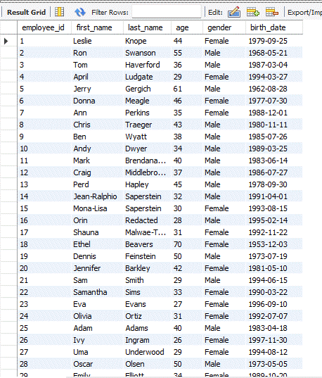
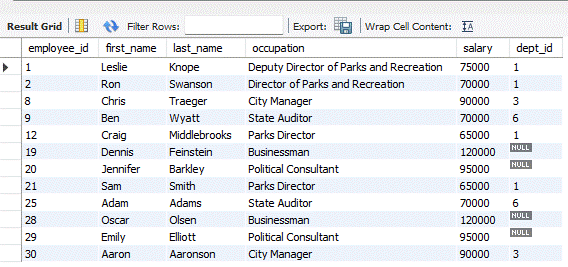
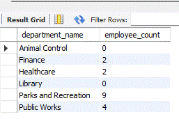

# **Parks and Recreation Database Project**

This project is designed to create and manage a database for a Parks and Recreation department. It includes SQL scripts for database creation, table creation, data insertion, and analytical reports.

---

## Visual Representation of Database Tables

Below are the embedded images from the `media` folder that demonstrate a visual representation of the database tables:

### Employee Demographics Table


### Employee Salary Table


### Parks Departments Table


---

## Table of Contents

- [Project Structure](#project-structure)
- [Getting Started](#getting-started)
- [Database Setup](#database-setup)
- [Data Insertion](#data-insertion)
- [Analytical Insights](#analytical-insights)
- [Media](#media)
- [License](#license)

---

## Project Structure

The project is organized as follows:

```
C:.
│   .gitattributes
│   LICENSE
│   README.md
│
├───csv_files
│       employee_demographics.csv
│       employee_salary.csv
│       parks_departments.csv
│
├───database
│   │   create_database.sql
│   │   README.md
│   │
│   ├───create_tables
│   │       create_parks_departments.sql
│   │       create_employee_demographics.sql
│   │       create_employee_salary.sql
│   │
│   └───insert_data
│           insert_parks_departments.sql
│           insert_employee_demographics.sql
│           insert_employee_salary.sql
│
├───media
│   └───table_view
│           employee_demographics.gif
│           employee_salary.gif
│           parks_departments.gif
│
└───sql_queries_and_analytical_insights
    ├───employee_demography
    │       analytical_insights.md
    │       demography_queries.sql
    │
    ├───employee_salary
    │       analytical_insights.md
    │       salary_queries.sql
    │
    └───parks_departments
            analytical_insights.md
            departments_queries.sql
```

---

## Getting Started

To get started with this project, clone the repository to your local machine:

```bash
git clone <https://github.com/ewache04/Parks_and_Rec_Create_db>
```

---

## Database Setup

The database must be created, tables created, and data inserted in the **correct order** to ensure proper functionality. Follow these steps:

### **1️⃣ Create the Database**
Run the following command to create the **Parks and Recreation** database:

```sql
source database/create_database.sql;
```

---

### **2️⃣ Create Tables**
Execute the scripts below to create the required tables **in the following order**:

1. **Create `parks_departments` Table**:
   ```sql
   source database/create_tables/create_parks_departments.sql;
   ```

2. **Create `employee_demographics` Table**:
   ```sql
   source database/create_tables/create_employee_demographics.sql;
   ```

3. **Create `employee_salary` Table**:
   ```sql
   source database/create_tables/create_employee_salary.sql;
   ```

---

### **3️⃣ Insert Data**
After creating the tables, populate them by running the following scripts **in the correct order**:

1. **Insert Data into `parks_departments` Table**:
   ```sql
   source database/insert_data/insert_parks_departments.sql;
   ```

2. **Insert Data into `employee_demographics` Table**:
   ```sql
   source database/insert_data/insert_employee_demographics.sql;
   ```

3. **Insert Data into `employee_salary` Table**:
   ```sql
   source database/insert_data/insert_employee_salary.sql;
   ```

---

## Analytical Insights

The `sql_queries_and_analytical_insights` folder contains SQL queries and analytical insights for each table:

- **Employee Demography**: Insights and queries related to employee demographics.
- **Employee Salary**: Insights and queries related to employee salaries.
- **Parks Departments**: Insights and queries related to parks departments.

To view the analytical insights, navigate to the respective folders and open the `analytical_insights.md` files.

---

## Media

The `media` folder contains GIFs that provide a visual representation of the database tables. These images are displayed at the top of this README for quick reference.

---

## License

This project is licensed under the terms of the MIT license. See the [LICENSE](LICENSE) file for more details.